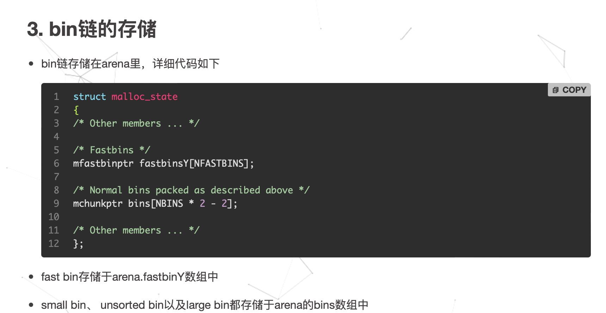
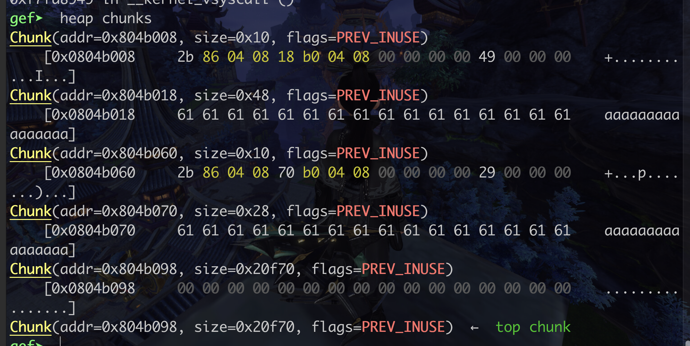

# 堆的基础概念


### 参考博客

https://kiprey.github.io/ 比较全的一个堆入门系列,讲的很不错!!!

https://etenal.me/archives/1121 关于堆的总结

https://etenal.me/archives/972 pwnable等 刷题记录

https://www.povcfe.site/posts/ptmalloc/ ptmalloc原理

https://eternalsakura13.com/2018/02/28/heap_exp1/ 

https://z3r3f.gitee.io/2019/02/22/pwn%E4%B9%8B%E5%A0%86%E5%AD%A6%E4%B9%A0%E7%9A%84%E5%85%A5%E9%97%A8%E7%B3%BB%E5%88%97/ 堆相关的总结

https://nightrainy.github.io/2019/05/06/glic%E5%86%85%E5%AD%98%E7%AE%A1%E7%90%86%E5%AD%A6%E4%B9%A0%E7%AC%94%E8%AE%B0/


## 基础

### bins

bins里存有126组双向链表

- 第1组是Unsorted bin
- 第2 到 63组是Small bin
- 第64 到 126组是Large bin


### unlink


## how2heap


## pwnable.kr

### fd


## 笔记:https://kiprey.github.io

- 当这个chunk为large chunk时，才会使用以下结构成员
  - `fd_nextsize`指向大于当前chunk大小、且位于相同large bin链的chunk
  - `bk_nextsize`指向小于当前chunk大小、且位于相同large bin链的chunk




fast bin的分组依据fast chunk的大小 两个相邻bin链里的chunk最大值相差8字节（32位）或16字节（64位）

- 以64字节为例
  `fastbinY[0]`指向的chunk大小为0x20 - 0x30
  `fastbinY[1]`指向的chunk大小为0x30 - 0x40
  `......`
  `fastbinY[5]`指向的chunk大小为0x70 - 0x80


### UAF


1. 申请一个64字节的堆块

2. 申请一个32字节的堆块

3. 释放第一个堆块

   如何申请64字节?  输入64的话得到的是0x50大小, 80, 对齐?  头信息? 

   申请32字节,得到 48

   对齐: https://www.codenong.com/672461/

饿,是因为libc的问题,切换成32位的就可以了




```
gef➤  x /8wx 0x804b010
0x804b010:	0x00000000	0x00000049	0xf7fb27b0	0xf7fb27b0
0x804b020:	0x00000000	0x00000000	0x00000000	0x00000000
```

这前面是多少个字节呢?  bk fd前面

???????????????????//


https://kiprey.github.io/2020/05/heap-12-fastbin_attack/

感觉作者真得很有水平呀,很多细节、关键的地方,讲解的很到位! 


